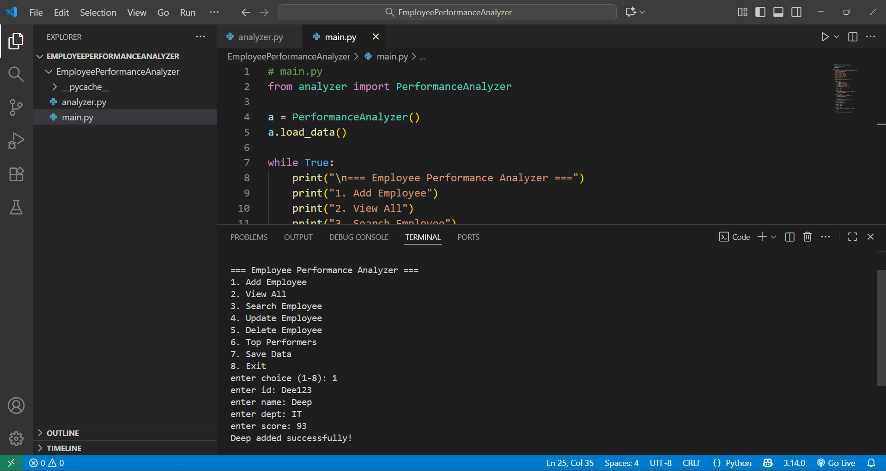
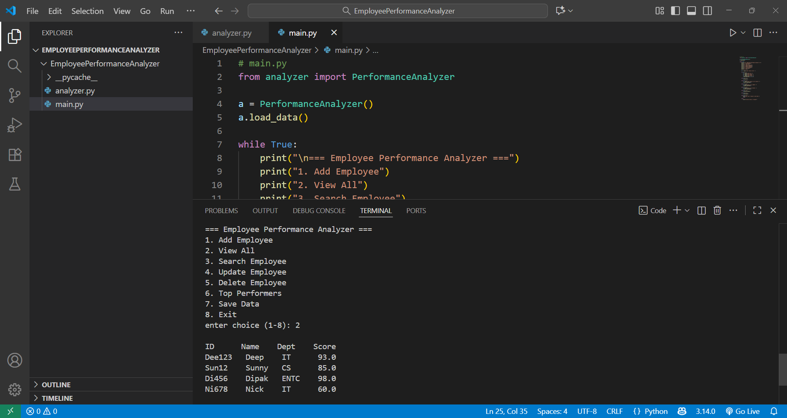
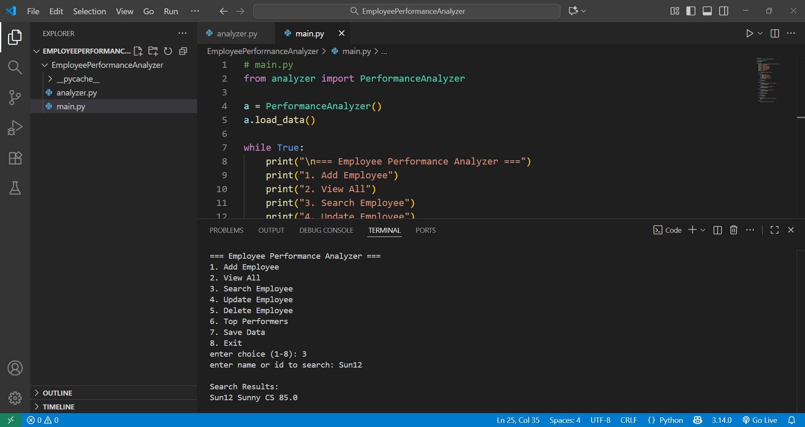
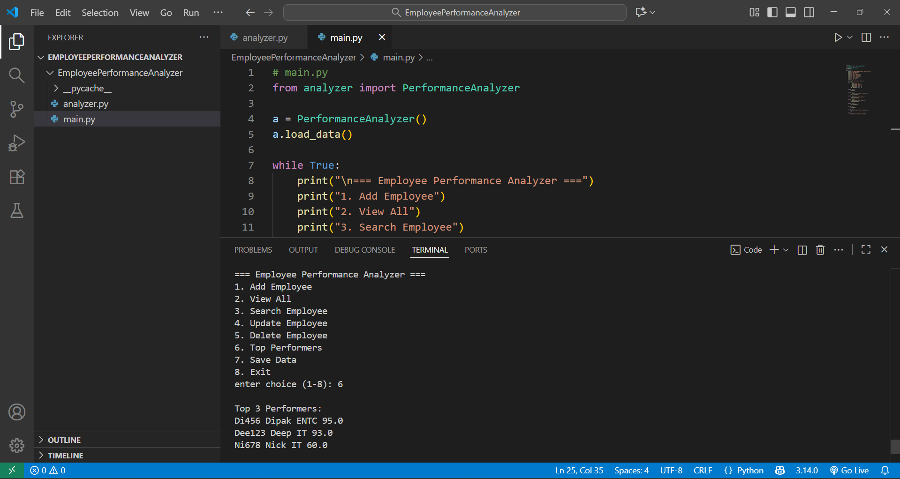

# Employee Performance Analyzer (Python)

This is a simple Python project to **manage and analyze employee performance**.  
It allows adding, viewing, searching, updating, deleting employee records and also identifies **Top 3 performers** based on performance score.  
Data is stored permanently in a **CSV file**, so it is not lost when the program closes.

## 🔧 Features
- Add Employee (ID, Name, Department, Score)
- View All Employees in table format
- Search Employee by **ID** or **Name**
- Update Employee details
- Delete Employee
- Display **Top 3 Performers** by score
- Save & Load data using CSV
- Input validation and duplicate ID prevention

## 🛠️ Tech Used
| Component | Description |
|----------|-------------|
| Language | Python |
| Concepts | OOP (Classes & Objects), Lists, File Handling, CSV |
| Environment | VS Code  / Terminal |

## 📂 Project Structure
EmployeePerformanceAnalyzer/
│
├── analyzer.py        # Backend logic (add, search, update, delete, save, load)
├── main.py            # Main menu interface
├── README.md          # Documentation
└── (employees.csv)    # Automatically created after save

## 🖼️ Screenshots

> The following screenshots demonstrate the working of the Employee Performance Analyzer project.

| Feature | Screenshot |
|--------|------------|
| Adding Employees |  |
| Viewing All Employees |  |
| Searching Employee |  |
| Top Performers |  |

## 🎯 Learning Outcomes
- Applied **Object-Oriented Programming**
- Used **CSV file handling**
- Created a **Menu-driven CLI application**
- Implemented searching, sorting & updating features

